<h1 align="center">Hi there 👋🏾🧑🏾, I'm Isaac Alves Pinheiro!</h1>
<!-- I created my README.md using Markdown & HTML5-->
<h3 align="center">🥽🥼 <em>Welcome to my lab!</em> 🖥️🧪</h3>

## 👨🏾‍🔬 About me

<ul>
 <li>⚛️ I'm 20 years old and in the 3rd period of the bachelor's degree of Computer Science. :atom: :electron:</li>
 <li>🔠 I'm B2 in the English language. 🇺🇸 💙❤️️🤍</li>
 <li>😄 I really like to learn more and more! 🐱‍💻🐱‍👤</li>
 <li>🔭 I’m currently working on Full-Stack development. 👨🏾‍🚀🌎</li>
 <li>🌱 I’m currently learning about Programming Paradigms, Reactive programming, Design Patterns, MVC, Microservices, API's, RESTful API, Agile methodology and Framework Scrum, UML, UI/UX Design, Microcontrollers, IoT, Voice Recognition, Cloud Computing, DevOps, Computer Networks, Distributed Computing, Cybersecurity, AI, Machine Learning, Deep Learning, Natural Language Processing, Modern Math and Physic, Calculus (I, II, III and IV), Quantum Mechanics, Quantum Computing. 🌱🌲</li>
 <li>👯 I’m looking to collaborate on new web applications, hybrid apps and multiplataform desktop applications. 💧:octocat:</li>
 <li>💜 I'm very passionate about technologies and i'm always learning and creating new applications, projects and implementing them.</li>
 <li>🎯 Focused in Full-Stack development. 🐱‍🚀 🚀</li>
</ul>

## 👨🏾‍💻 Knowledge and skills
<!--The same height for everybody-->

&nbsp; &nbsp; &nbsp;    &nbsp;&nbsp;  &nbsp;&nbsp; &nbsp; &nbsp; &nbsp; &nbsp; &nbsp; &nbsp;    &nbsp; &nbsp;&nbsp;&nbsp;&nbsp; &nbsp;&nbsp;  &nbsp; &nbsp;  &nbsp; &nbsp; &nbsp; &nbsp; &nbsp; &nbsp; &nbsp; &nbsp; &nbsp; &nbsp; &nbsp; &nbsp; &nbsp; &nbsp; &nbsp; &nbsp; &nbsp; &nbsp;&nbsp;  &nbsp; &nbsp; &nbsp; &nbsp; &nbsp; &nbsp; &nbsp;&nbsp; &nbsp; &nbsp; &nbsp; &nbsp; &nbsp; &nbsp;&nbsp; &nbsp; &nbsp;  &nbsp;&nbsp;&nbsp; &nbsp; &nbsp;     &nbsp; &nbsp;&nbsp; &nbsp; &nbsp;&nbsp; &nbsp; &nbsp; </a>&nbsp;  &nbsp; &nbsp;  &nbsp; &nbsp; &nbsp;   &nbsp; &nbsp;&nbsp; &nbsp; &nbsp; &nbsp; &nbsp; &nbsp; &nbsp; &nbsp; &nbsp;&nbsp;&nbsp; &nbsp; &nbsp;&nbsp; &nbsp; </a>&nbsp;&nbsp;  &nbsp; &nbsp;  

## 💁🏾‍♂️ Status and progress

  

⚓ 🌊🌊🌊 

 🌊🌊🌊 🦢

